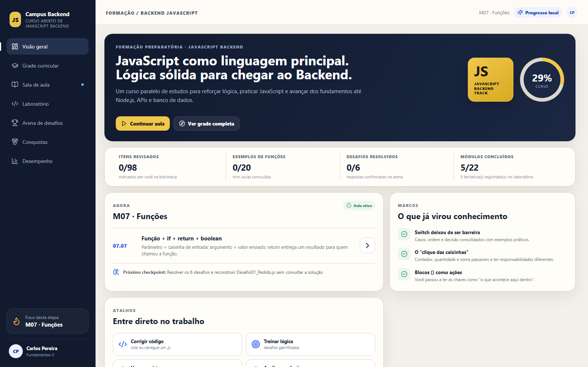
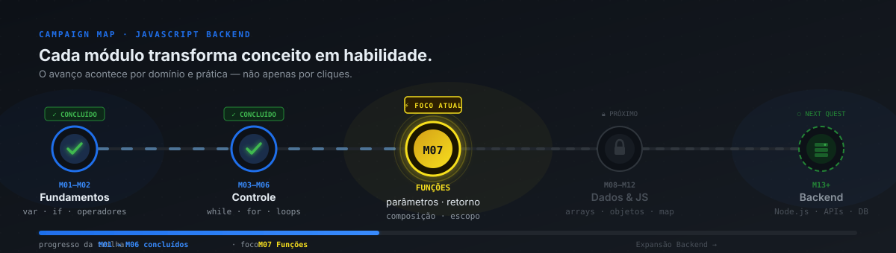
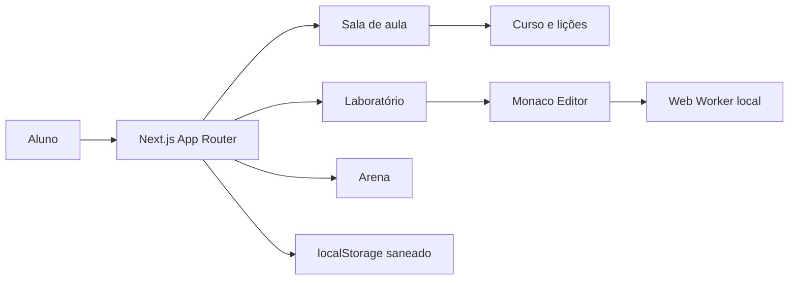

<div align="center">



<br/>


**Um campus preparatório independente para fortalecer lógica, praticar JavaScript e construir a base necessária para Backend.**

Criado por **Carlos Alexandre Duarte Pereira** durante sua formação para o curso de **Desenvolvedor Backend** da **Escola SENAI "Dr. Celso Charuri"** e aberto para outras pessoas que também queiram aprender.

[Ver o Campus](#o-campus-em-ação) · [Começar agora](#comece-a-estudar) · [Explorar a trilha](#modo-campanha) · [Conhecer o autor](#quem-está-construindo)

</div>

> [!IMPORTANT]
> Este é um projeto pessoal e independente de preparação e aprofundamento. Não é material oficial, não representa a Escola SENAI "Dr. Celso Charuri" e não substitui suas aulas ou formações.

## O Campus em ação



O Campus transforma uma rotina de estudos em um ambiente único, no qual o aluno sempre consegue responder:

| Onde estou? | O que já aprendi? | Qual é o próximo passo? |
|---|---|---|
| Dashboard, grade e módulo atual | Biblioteca, conquistas e desempenho | Aula, laboratório, arena e checkpoint |

### O que você encontra

| Experiência | Para que serve |
|---|---|
| **Sala de aula** | Estudar a aula atual e reabrir conteúdos concluídos sem perder o histórico |
| **Grade curricular** | Visualizar módulos concluídos, em andamento, liberados e planejados |
| **Laboratório** | Escrever e executar JavaScript em um Monaco Editor com Web Worker local |
| **Arena de desafios** | Treinar lógica com exercícios e feedback de progresso |
| **Biblioteca de revisão** | Marcar uma nova rodada de estudo sem apagar o conhecimento conquistado |
| **Conquistas e desempenho** | Enxergar marcos de domínio e habilidades praticadas |

## Comece a estudar

Você precisa ter **Node.js**, **npm** e **Git** instalados.

```bash
git clone https://github.com/carloska24/Pratica_Back-End_Senai.git
cd Pratica_Back-End_Senai
npm install
npm run dev
```

Abra [http://localhost:3000](http://localhost:3000) no navegador. Todo o progresso atual fica salvo localmente no próprio navegador.

<details>
<summary><strong>Comandos disponíveis</strong></summary>

| Comando | Resultado |
|---|---|
| `npm run dev` | Inicia o Campus em modo de desenvolvimento |
| `npm run build` | Valida e gera o build de produção |
| `npm run start` | Executa localmente o build já gerado |

</details>

## Modo campanha

O aprendizado foi organizado como uma campanha: cada fase entrega uma habilidade reutilizável e prepara a próxima missão.



### Currículo em resumo

| Fase | Módulos | Habilidade construída |
|---|---:|---|
| Fundamentos | M01–M02 | Variáveis, operadores e decisões |
| Controle de fluxo | M03–M06 | `while`, `for`, contadores, acumuladores e laços aninhados |
| Foco atual | M07 | Funções, parâmetros, retorno e composição |
| Estruturas de dados | M08–M12 | Arrays, objetos, strings, datas e JavaScript moderno |
| Expansão Backend | Próximos módulos | Assincronismo, Node.js, HTTP, APIs, banco de dados e testes |

<details>
<summary><strong>Ver os módulos M01–M12</strong></summary>

| Módulo | Tema | Evidência de aprendizagem |
|---|---|---|
| M01 | Fundamentos JavaScript | Exercícios e desafio de base |
| M02 | Estruturas de decisão | Condições e fluxo de escolha |
| M03 | Laços com `while` | Repetição controlada |
| M04 | Laços com `for` | Contagem e padrões |
| M05 | Repetição avançada | Contador e acumulador |
| M06 | Laços aninhados | Construção de padrões em duas dimensões |
| M07 | Funções | Missão funcional com casos de teste |
| M08 | Arrays | Busca, índices e mutação |
| M09 | Objetos JavaScript | Modelagem de informações |
| M10 | Strings, Math e Date | Tratamento de dados |
| M11 | Arrays modernos | `forEach`, `map`, `filter` e `reduce` |
| M12 | JavaScript moderno | Arrow functions, destructuring, spread e REST |

</details>

## Como uma aula funciona

Antes de apresentar sintaxe, cada aula constrói um modelo mental do problema.

```text
objetivo → pré-requisitos → história do programa → execução passo a passo
         → conceitos → código comentado → leitura mental → checkpoint
```

Esse método busca ensinar o aluno a prever o comportamento do código, explicar suas decisões e só então avançar.

## Exercícios JavaScript

A pasta [`course/exercicios-javascript/`](./course/exercicios-javascript/) contém **69 arquivos `.js`**, organizados do M01 ao M12 para prática direta no editor.

```text
course/exercicios-javascript/
├── M01/  fundamentos e primeiros desafios
├── M02/  decisões
├── M03–M06/  repetição e padrões
├── M07/  funções
└── M08–M12/  arrays, objetos, dados e JavaScript moderno
```

Os exercícios acompanham a mesma sequência do portal e podem ser usados para revisão, prática individual ou consulta.

## Quem está construindo

<div align="center">



</div>

> Este projeto nasceu no meio da prática. Eu queria estudar com constância, revisar lógica sem me perder e enxergar minha evolução módulo por módulo. Em vez de deixar esse material fechado no meu computador, organizei um campus para quem também quer construir uma base sólida em JavaScript antes de avançar para Backend.

<div align="center">

[](https://www.linkedin.com/in/carlos-duarte-0b4591206)
[](mailto:carloska24@gmail.com)
[](https://github.com/carloska24)

</div>

## Por dentro do projeto

| Camada | Tecnologias e responsabilidades |
|---|---|
| Interface | Next.js 15, React 19, TypeScript, Framer Motion e Lucide |
| Conteúdo | Currículo, aulas, exemplos guiados e exercícios JavaScript |
| Laboratório | Monaco Editor, Web Worker, timeout e captura de console |
| Progresso | `localStorage` com saneamento de identificadores e contadores |

<div align="center">


&nbsp;&nbsp;

&nbsp;&nbsp;

&nbsp;&nbsp;

&nbsp;&nbsp;


</div>

<details>
<summary><strong>Arquitetura atual</strong></summary>



O código escrito pelo aluno é executado no navegador, dentro de um Web Worker com timeout e rede desativada. Ele não é executado no processo do Next.js.

</details>

<details>
<summary><strong>Estrutura principal de pastas</strong></summary>

```text
campus-backend-senai-javascript/
├── src/
│   ├── app/                rotas, shell e estilos globais
│   ├── components/         sala, laboratórios e arena de prática
│   ├── content/            currículo, aulas e exemplos guiados
│   └── lib/                persistência e utilitários
├── course/
│   └── exercicios-javascript/  prática organizada por módulo
├── docs/
│   ├── assets/             imagens do README
│   ├── ARCHITECTURE.md     decisões e evolução técnica
│   ├── PRODUCT.md          princípios de produto e aprendizagem
│   └── UX_RESEARCH.md      pesquisa e decisões de experiência
├── package.json
└── README.md
```

</details>

### Documentação complementar

- [`docs/PRODUCT.md`](./docs/PRODUCT.md): missão, princípios pedagógicos e evolução do produto.
- [`docs/ARCHITECTURE.md`](./docs/ARCHITECTURE.md): responsabilidades técnicas, segurança e próximos passos.
- [`docs/UX_RESEARCH.md`](./docs/UX_RESEARCH.md): observações que orientam a experiência de estudo.

## Estado atual

O Campus já possui conteúdo navegável, progresso local, exercícios, revisões, exemplos guiados, laboratório e missões com validações específicas. O build de produção é validado com `npm run build`.

Ainda estão planejados:

- autenticação e sincronização do progresso;
- Backend real e banco de dados;
- runner Node.js isolado para código não confiável;
- rotas dedicadas para módulos e aulas;
- cobertura automatizada unitária e E2E;
- publicação do portal para acesso público.

## Aprender junto

O Campus está sendo construído primeiro como uma ferramenta real de estudo e, ao mesmo tempo, como uma trilha que outras pessoas possam acompanhar. Sugestões sobre aulas, exercícios, clareza do conteúdo e experiência do portal são bem-vindas por meio das [issues do repositório](https://github.com/carloska24/Pratica_Back-End_Senai/issues).

<div align="center">

---

**Campus Backend**<br/>
Estudar com intenção. Praticar com constância. Compartilhar o caminho.

</div>
