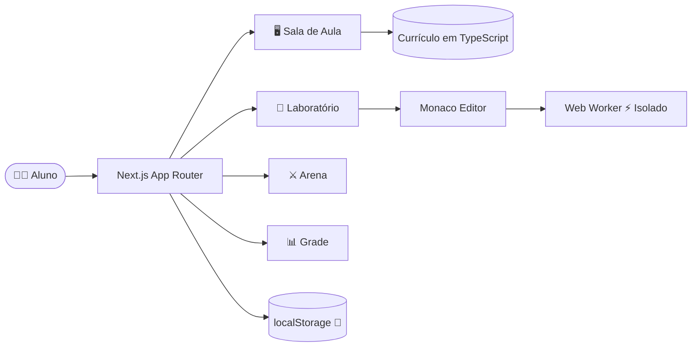

<div align="center">


</div>

<div align="center">

<!-- Stack Principal -->


<br/>

<!-- Métricas do Projeto -->


<br/>

**[🎓 O Campus](#-o-campus-em-ação) · [⚡ Começar](#-início-rápido) · [🗺️ Trilha](#-trilha-de-aprendizado) · [🏗️ Arquitetura](#-arquitetura-técnica) · [👨‍💻 Autor](#-sobre-o-autor)**

</div>

---

## 📌 Sobre o Projeto

<table>
<tr>
<td width="58%">

O **Campus Backend** não é mais um repositório de exercícios soltos.

É uma **plataforma educacional interativa** — construída com Next.js 15, Monaco Editor e Web Workers — criada durante a formação no curso de **Desenvolvedor Backend** da **Escola SENAI "Dr. Celso Charuri"** por **Carlos Alexandre Duarte Pereira**.

A proposta: transformar a rotina de estudos em algo que você **queira abrir todo dia**.

</td>
<td width="42%" align="center">

```
┌──────────────────────────────┐
│       CAMPUS BACKEND         │
├──────────────────────────────┤
│  🖥️  Sala de Aula            │
│  🧪  Laboratório Monaco      │
│  ⚔️  Arena de Desafios       │
│  🏆  Sistema de Progresso    │
│  📋  Grade Curricular        │
│  📖  Biblioteca de Revisão   │
└──────────────────────────────┘
```

</td>
</tr>
</table>

> [!IMPORTANT]
> Projeto **pessoal e independente**. Não representa a Escola SENAI "Dr. Celso Charuri" e não substitui suas aulas ou formações oficiais.

---

## 🎓 O Campus em Ação

<div align="center">

</div>

<br/>

O Campus foi desenhado para que o aluno **sempre saiba** onde está, o que conquistou e qual é o próximo passo:

<div align="center">

| 🧭 Onde Estou? | 🏅 O que já Aprendi? | ⬆️ Qual o Próximo Passo? |
|:---:|:---:|:---:|
| Dashboard, grade e módulo atual | Biblioteca, conquistas e desempenho | Aula, laboratório, arena e checkpoint |

</div>

<br/>

### 🔬 Experiências disponíveis

<div align="center">

| Área | Descrição |
|:---|:---|
| 🖥️ **Sala de Aula** | Estude a aula atual e reabra conteúdos concluídos sem perder o histórico |
| 📊 **Grade Curricular** | Visualize módulos concluídos, em andamento, liberados e planejados |
| 🧪 **Laboratório** | Escreva e execute JavaScript num Monaco Editor com Web Worker local |
| ⚔️ **Arena de Desafios** | Treine lógica com exercícios e feedback de progresso em tempo real |
| 📚 **Biblioteca de Revisão** | Marque uma nova rodada de estudo sem apagar o conhecimento conquistado |
| 🏆 **Conquistas e Desempenho** | Visualize marcos de domínio e habilidades praticadas |

</div>

---

## ⚡ Início Rápido

> Você precisa ter **[Node.js](https://nodejs.org/)**, **npm** e **[Git](https://git-scm.com/)** instalados.

```bash
# Clone o repositório
git clone https://github.com/carloska24/Pratica_Back-End_Senai.git

# Entre na pasta
cd Pratica_Back-End_Senai

# Instale as dependências
npm install

# Inicie em modo de desenvolvimento
npm run dev
```

🌐 Acesse **[http://localhost:3000](http://localhost:3000)** — todo progresso é salvo no **localStorage**, sem cadastro.

<details>
<summary><strong>📋 Comandos disponíveis</strong></summary>
<br/>

| Comando | O que faz |
|:---|:---|
| `npm run dev` | Inicia em modo de desenvolvimento com hot-reload |
| `npm run build` | Valida e gera o build de produção |
| `npm run start` | Executa localmente o build gerado |

</details>

---

## 🗺️ Trilha de Aprendizado

O currículo foi estruturado como uma **campanha progressiva** — cada fase entrega uma habilidade real e abre a porta para a próxima.


<br/>

### 📋 Currículo Completo

<div align="center">

| Fase | Módulos | Habilidade Construída | Status |
|:---:|:---:|:---|:---:|
| Fundamentos | M01 – M02 | Variáveis, operadores e decisões | ✅ Concluído |
| Controle de Fluxo | M03 – M06 | `while`, `for`, contadores, acumuladores e laços aninhados | ✅ Concluído |
| **Foco Atual** | **M07** | **Funções, parâmetros, retorno e composição** | 🔥 Em andamento |
| Estruturas de Dados | M08 – M12 | Arrays, objetos, strings, datas e JavaScript moderno | 🔒 Próximos |
| Expansão Backend | M13+ | Assincronismo, Node.js, HTTP, APIs, banco de dados e testes | 🔒 Planejado |

</div>

<details>
<summary><strong>📖 Ver todos os módulos (M01–M12)</strong></summary>
<br/>

| # | Módulo | Tema | Evidência de Aprendizagem |
|:---:|:---:|:---|:---|
| 01 | M01 | Fundamentos JavaScript | Exercícios e desafio de base |
| 02 | M02 | Estruturas de Decisão | Condições e fluxo de escolha |
| 03 | M03 | Laços com `while` | Repetição controlada |
| 04 | M04 | Laços com `for` | Contagem e padrões |
| 05 | M05 | Repetição Avançada | Contador e acumulador |
| 06 | M06 | Laços Aninhados | Construção de padrões em duas dimensões |
| 07 | M07 | **Funções** | Missão funcional com casos de teste |
| 08 | M08 | Arrays | Busca, índices e mutação |
| 09 | M09 | Objetos JavaScript | Modelagem de informações |
| 10 | M10 | Strings, Math e Date | Tratamento de dados |
| 11 | M11 | Arrays Modernos | `forEach`, `map`, `filter` e `reduce` |
| 12 | M12 | JavaScript Moderno | Arrow functions, destructuring, spread e REST |

</details>

---

## 🧠 Método de Aprendizado

Antes de mostrar sintaxe, cada aula **constrói um modelo mental do problema**:

```
objetivo → pré-requisitos → história do programa → execução passo a passo
         → conceitos → código comentado → leitura mental → checkpoint
```

> O método busca ensinar o aluno a **prever o comportamento do código**, **explicar suas decisões** e só então avançar. Sem atalhos. Com intenção.

---

## 📁 Exercícios JavaScript

A pasta [`course/exercicios-javascript/`](./course/exercicios-javascript/) contém **69 arquivos `.js`**, organizados do M01 ao M12 para prática direta no editor de sua preferência — sem precisar rodar a plataforma.

<details>
<summary><strong>📂 Ver estrutura de pastas dos exercícios</strong></summary>
<br/>

```
course/
└── exercicios-javascript/
    ├── M01/   → fundamentos e primeiros desafios
    ├── M02/   → estruturas de decisão
    ├── M03/   → laços com while
    ├── M04/   → laços com for
    ├── M05/   → repetição avançada
    ├── M06/   → laços aninhados
    ├── M07/   → funções
    ├── M08/   → arrays
    ├── M09/   → objetos
    ├── M10/   → strings, math e date
    ├── M11/   → arrays modernos
    └── M12/   → javascript moderno
```

</details>

---

## 🧭 Por Dentro do Campus

Conheça as tecnologias, o fluxo de execução e a organização que sustentam a experiência de aprendizagem do Campus.

### Stack

<div align="center">


&nbsp;&nbsp;

&nbsp;&nbsp;

&nbsp;&nbsp;

&nbsp;&nbsp;


</div>

<br/>

| Camada e tecnologias | Responsabilidade |
|:---|:---|
| **🎨 Interface**<br/>Next.js 15 · React 19 · TypeScript · Framer Motion | Navegação, animações e composição das telas |
| **📖 Conteúdo**<br/>Currículo em TypeScript | Aulas, exercícios e exemplos guiados |
| **🧪 Laboratório**<br/>Monaco Editor · Web Worker | Execução segura de código JavaScript no browser |
| **💾 Progresso**<br/>`localStorage` com saneamento | Persistência local sem servidor ou autenticação |

### Fluxo da Aplicação



> **Segurança do Lab:** O código do aluno roda **exclusivamente no browser**, em Web Worker isolado com timeout e rede desativada. Nunca entra no processo do Next.js.

### 🗺️ Mapa do Projeto

| Área do Campus | Responsabilidade |
|:---|:---|
| **🚪 Entrada**<br/>`src/app/` | Inicialização do Next.js, layout e estilos globais |
| **🧩 Experiência**<br/>`src/features/` | Navegação, sala de aula, laboratórios e arena de desafios |
| **📚 Currículo**<br/>`src/course/` | Fonte de verdade dos módulos e conteúdos pedagógicos |
| **⚡ Execução**<br/>`src/runner/` | Análise, testes e execução JavaScript em Web Worker |
| **📈 Progresso**<br/>`src/progress/` | Regras de evolução e persistência local do estudante |
| **💻 Exercícios**<br/>`course/exercicios-javascript/` | Práticas executáveis organizadas de M01 a M12 |
| **📐 Documentação**<br/>`docs/` | Arquitetura, produto, UX, automação e recursos visuais |
| **🤖 Automação**<br/>`.github/workflows/` | CI, auditoria, build e atualização das métricas |

```
Pratica_Back-End_Senai/
├── src/
│   ├── app/
│   ├── course/
│   ├── features/
│   │   ├── shell/
│   │   ├── classroom/
│   │   │   └── labs/
│   │   └── practice/
│   ├── progress/
│   └── runner/
├── course/
│   └── exercicios-javascript/
│       └── M01 ... M12
├── docs/
│   ├── assets/
│   └── *.md
├── .github/
│   └── workflows/
├── package.json
└── README.md
```

---

## 🚧 Roadmap

<div align="center">

| Status | Feature |
|:---:|:---|
| ✅ | Conteúdo navegável com aulas e exemplos guiados |
| ✅ | Laboratório Monaco com Web Worker isolado |
| ✅ | Arena de desafios com validação e progresso |
| ✅ | Biblioteca de revisão com histórico de conquistas |
| ✅ | Persistência local via localStorage saneado |
| ✅ | Build de produção validado (`npm run build`) |
| 🔜 | Autenticação e sincronização de progresso na nuvem |
| 🔜 | Backend real com banco de dados |
| 🔜 | Runner Node.js isolado para código não confiável |
| 🔜 | Rotas dedicadas por módulo e aula |
| 🔜 | Cobertura automatizada: testes unitários e E2E |
| 🔜 | Publicação do portal para acesso público |

</div>

---

## 📄 Documentação

| Documento | Conteúdo |
|:---|:---|
| [`docs/PRODUCT.md`](./docs/PRODUCT.md) | Missão, princípios pedagógicos e visão de produto |
| [`docs/ARCHITECTURE.md`](./docs/ARCHITECTURE.md) | Responsabilidades técnicas, segurança e próximos passos |
| [`docs/UX_RESEARCH.md`](./docs/UX_RESEARCH.md) | Observações que orientam a experiência de estudo |

---

## 🤝 Contribuindo

Sugestões sobre aulas, exercícios, conteúdo ou experiência do portal são bem-vindas.

```bash
# Fork → branch → commit → pull request
git checkout -b feature/minha-sugestao
git commit -m "feat: adiciona exercício de closures no M07"
git push origin feature/minha-sugestao
```

Ou abra uma [**issue**](https://github.com/carloska24/Pratica_Back-End_Senai/issues) descrevendo sua ideia.

---

## 👨‍💻 Sobre o Autor


<br/>

<div align="center">

> *"Este projeto nasceu no meio da prática. Eu queria estudar com constância, revisar lógica sem me perder e enxergar minha evolução módulo por módulo. Em vez de deixar esse material fechado, organizei um campus para quem também quer construir uma base sólida em JavaScript antes de avançar para Backend."*
>
> — **Carlos Alexandre Duarte Pereira**

<br/>

[](https://www.linkedin.com/in/carlos-duarte-0b4591206)
[](https://github.com/carloska24)
[](mailto:carloska24@gmail.com)

</div>

---

<div align="center">


**Campus Backend** · Criado com 💙 por [Carlos Alexandre](https://github.com/carloska24)

*study → build → document → share*


</div>
