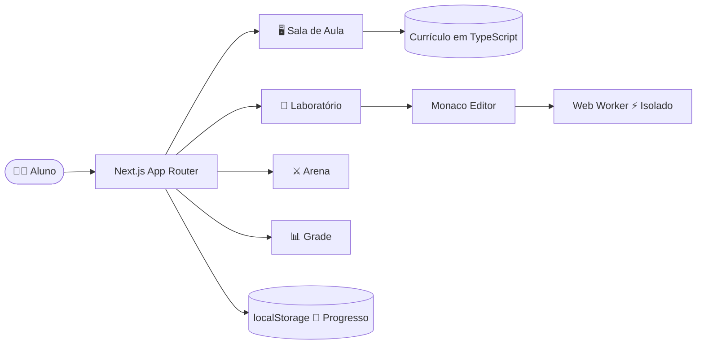

<div align="center">


</div>

<div align="center">

<!-- Status e Versão -->


<br/>

<!-- Stack Principal -->


<br/>

<!-- Métricas do Projeto -->


<br/>

**[🏕️ Explorar o Campus](#-o-campus-em-ação) · [⚡ Começar Agora](#-início-rápido) · [🗺️ Ver a Trilha](#-trilha-de-aprendizado) · [👨‍💻 Conhecer o Autor](#-sobre-o-autor)**

<br/>

> *"Não aprendi Backend lendo sobre ele. Aprendi construindo um ambiente onde aprender fosse difícil de parar."*

</div>

---

## 📌 Sobre o Projeto

<table>
<tr>
<td width="60%">

O **Campus Backend** não é mais um repositório de exercícios soltos num arquivo `.js`.

É uma **plataforma educacional interativa** — construída do zero com Next.js 15, Monaco Editor e Web Workers — criada durante a formação para o curso de **Desenvolvedor Backend** da **Escola SENAI "Dr. Celso Charuri"** pelo estudante **Carlos Alexandre Duarte Pereira**.

A proposta é simples: transformar a rotina de estudos em algo que você **queira abrir todo dia**.

</td>
<td width="40%" align="center">

```
┌─────────────────────────────┐
│        CAMPUS BACKEND       │
├─────────────────────────────┤
│  📚  Sala de Aula           │
│  🧪  Laboratório Monaco     │
│  ⚔️  Arena de Desafios      │
│  🏆  Sistema de Progresso   │
│  📋  Grade Curricular       │
│  📖  Biblioteca de Revisão  │
└─────────────────────────────┘
```

</td>
</tr>
</table>

> [!IMPORTANT]
> Este é um projeto **pessoal e independente**. Não representa a Escola SENAI "Dr. Celso Charuri" e não substitui suas aulas ou formações oficiais.

---

## 🎓 O Campus em Ação

<div align="center">

</div>

<br/>

O Campus foi desenhado para que o aluno **sempre saiba** onde está, o que conquistou e qual é o próximo passo:

<div align="center">

| 🧭 Onde Estou? | 🏅 O que já Aprendi? | ⬆️ Qual o Próximo Passo? |
|:---:|:---:|:---:|
| Dashboard, grade e módulo atual | Biblioteca, conquistas e desempenho | Aula, laboratório, arena e checkpoint |

</div>

<br/>

### 🔬 Experiências disponíveis

<div align="center">

| Área | Descrição |
|:---|:---|
| 🖥️ **Sala de Aula** | Estude a aula atual e reabra conteúdos concluídos sem perder o histórico |
| 📊 **Grade Curricular** | Visualize módulos concluídos, em andamento, liberados e planejados |
| 🧪 **Laboratório** | Escreva e execute JavaScript num Monaco Editor com Web Worker local |
| ⚔️ **Arena de Desafios** | Treine lógica com exercícios e feedback de progresso em tempo real |
| 📚 **Biblioteca de Revisão** | Marque uma nova rodada de estudo sem apagar o conhecimento conquistado |
| 🏆 **Conquistas e Desempenho** | Visualize marcos de domínio e habilidades praticadas |

</div>

---

## ⚡ Início Rápido

> Você precisa ter **[Node.js](https://nodejs.org/)**, **npm** e **[Git](https://git-scm.com/)** instalados.

```bash
# 1. Clone o repositório
git clone https://github.com/carloska24/Pratica_Back-End_Senai.git

# 2. Entre na pasta do projeto
cd Pratica_Back-End_Senai

# 3. Instale as dependências
npm install

# 4. Inicie o Campus em modo de desenvolvimento
npm run dev
```

🌐 Abra **[http://localhost:3000](http://localhost:3000)** no seu navegador.

> Todo o progresso é salvo automaticamente no **localStorage** do próprio navegador — sem cadastro, sem servidor.

<details>
<summary><strong>📋 Todos os comandos disponíveis</strong></summary>
<br/>

| Comando | O que faz |
|:---|:---|
| `npm run dev` | Inicia o Campus em modo de desenvolvimento com hot-reload |
| `npm run build` | Valida e gera o build de produção |
| `npm run start` | Executa localmente o build já gerado |

</details>

---

## 🗺️ Trilha de Aprendizado

O currículo foi estruturado como uma **campanha progressiva**: cada fase entrega uma habilidade real e abre a porta para a próxima.

<div align="center">

</div>

<br/>

```
FUNDAMENTOS ──► CONTROLE DE FLUXO ──► FUNÇÕES ──► DADOS ──► JS MODERNO ──► BACKEND
   M01-M02            M03-M06           M07       M08-M10     M11-M12       Próximos
```

<br/>

### 📋 Currículo Completo

<div align="center">

| Fase | Módulos | Habilidade Construída | Status |
|:---:|:---:|:---|:---:|
| Fundamentos | M01 – M02 | Variáveis, operadores e decisões | ✅ Concluído |
| Controle de Fluxo | M03 – M06 | `while`, `for`, contadores, acumuladores e laços aninhados | ✅ Concluído |
| **Foco Atual** | **M07** | **Funções, parâmetros, retorno e composição** | 🔥 Em andamento |
| Estruturas de Dados | M08 – M12 | Arrays, objetos, strings, datas e JavaScript moderno | 🔒 Próximos |
| Expansão Backend | M13+ | Assincronismo, Node.js, HTTP, APIs, banco de dados e testes | 🔒 Planejado |

</div>

<details>
<summary><strong>📖 Ver detalhes de todos os módulos (M01–M12)</strong></summary>
<br/>

| # | Módulo | Tema | Evidência de Aprendizagem |
|:---:|:---:|:---|:---|
| 01 | M01 | Fundamentos JavaScript | Exercícios e desafio de base |
| 02 | M02 | Estruturas de Decisão | Condições e fluxo de escolha |
| 03 | M03 | Laços com `while` | Repetição controlada |
| 04 | M04 | Laços com `for` | Contagem e padrões |
| 05 | M05 | Repetição Avançada | Contador e acumulador |
| 06 | M06 | Laços Aninhados | Construção de padrões em duas dimensões |
| 07 | M07 | **Funções** | Missão funcional com casos de teste |
| 08 | M08 | Arrays | Busca, índices e mutação |
| 09 | M09 | Objetos JavaScript | Modelagem de informações |
| 10 | M10 | Strings, Math e Date | Tratamento de dados |
| 11 | M11 | Arrays Modernos | `forEach`, `map`, `filter` e `reduce` |
| 12 | M12 | JavaScript Moderno | Arrow functions, destructuring, spread e REST |

</details>

---

## 🧠 Como uma Aula Funciona

Antes de mostrar sintaxe, cada aula **constrói um modelo mental do problema**:

```
 objetivo → pré-requisitos → história do programa → execução passo a passo
          → conceitos → código comentado → leitura mental → checkpoint
```

> O método busca ensinar o aluno a **prever o comportamento do código**, **explicar suas decisões** e só então avançar. Sem atalhos. Com intenção.

---

## 📁 Exercícios JavaScript

A pasta [`course/exercicios-javascript/`](./course/exercicios-javascript/) contém **69 arquivos `.js`**, organizados do M01 ao M12 para prática direta no editor de sua preferência.

```
course/
└── exercicios-javascript/
    ├── M01/   → fundamentos e primeiros desafios
    ├── M02/   → estruturas de decisão
    ├── M03/   → laços com while
    ├── M04/   → laços com for
    ├── M05/   → repetição avançada
    ├── M06/   → laços aninhados
    ├── M07/   → funções
    ├── M08/   → arrays
    ├── M09/   → objetos
    ├── M10/   → strings, math e date
    ├── M11/   → arrays modernos
    └── M12/   → javascript moderno
```

Os exercícios acompanham a mesma sequência do portal e podem ser usados para **revisão, prática individual ou consulta** sem precisar rodar a plataforma.

---

## 🏗️ Arquitetura Técnica

<details>
<summary><strong>🔍 Ver stack e diagrama completo</strong></summary>

<br/>

### Stack

<div align="center">


&nbsp;&nbsp;

&nbsp;&nbsp;

&nbsp;&nbsp;

&nbsp;&nbsp;


</div>

<br/>

| Camada | Tecnologias | Responsabilidade |
|:---|:---|:---|
| 🎨 Interface | Next.js 15, React 19, TypeScript, Framer Motion | Navegação, animações e composição das telas |
| 📖 Conteúdo | Currículo em TypeScript | Aulas, exercícios e exemplos guiados |
| 🧪 Laboratório | Monaco Editor + Web Worker | Execução segura de código JavaScript no browser |
| 💾 Progresso | `localStorage` com saneamento | Persistência local sem servidor ou autenticação |

### Fluxo da Aplicação



### Segurança do Laboratório

> O código escrito pelo aluno roda **exclusivamente no browser**, dentro de um **Web Worker** com timeout e acesso à rede desativados. Ele nunca entra no processo do Next.js.

### Estrutura de Pastas

```
campus-backend-senai-javascript/
├── src/
│   ├── app/                → rotas, shell e estilos globais
│   ├── components/
│   │   ├── classroom/      → sala de aula e visualização de aulas
│   │   ├── labs/           → experiências interativas das lições
│   │   └── practice/       → arena de desafios
│   ├── content/            → currículo, aulas e exemplos guiados
│   └── lib/                → persistência e utilitários
├── course/
│   └── exercicios-javascript/  → prática organizada por módulo
├── docs/
│   ├── assets/             → imagens do README e documentação
│   ├── ARCHITECTURE.md     → decisões e evolução técnica
│   ├── PRODUCT.md          → princípios de produto e aprendizagem
│   └── UX_RESEARCH.md      → pesquisa e decisões de experiência
├── package.json
└── README.md
```

</details>

---

## 🚧 Roadmap

O Campus está evoluindo. Aqui está o que já foi feito e o que vem por aí:

<div align="center">

| Status | Feature |
|:---:|:---|
| ✅ | Conteúdo navegável com aulas e exemplos guiados |
| ✅ | Laboratório Monaco com Web Worker isolado |
| ✅ | Arena de desafios com validação e progresso |
| ✅ | Biblioteca de revisão com histórico de conquistas |
| ✅ | Persistência local via localStorage saneado |
| ✅ | Build de produção validado (`npm run build`) |
| 🔜 | Autenticação e sincronização de progresso na nuvem |
| 🔜 | Backend real com banco de dados |
| 🔜 | Runner Node.js isolado para código não confiável |
| 🔜 | Rotas dedicadas por módulo e aula |
| 🔜 | Cobertura automatizada: testes unitários e E2E |
| 🔜 | Publicação do portal para acesso público |

</div>

---

## 📄 Documentação Complementar

| Documento | Conteúdo |
|:---|:---|
| [`docs/PRODUCT.md`](./docs/PRODUCT.md) | Missão, princípios pedagógicos e visão de produto |
| [`docs/ARCHITECTURE.md`](./docs/ARCHITECTURE.md) | Responsabilidades técnicas, segurança e próximos passos |
| [`docs/UX_RESEARCH.md`](./docs/UX_RESEARCH.md) | Observações que orientam a experiência de estudo |

---

## 🤝 Contribuindo

Sugestões sobre aulas, exercícios, clareza do conteúdo ou experiência do portal são muito bem-vindas.

```bash
# 1. Faça um fork do projeto
# 2. Crie uma branch para sua feature
git checkout -b feature/minha-sugestao

# 3. Commit suas mudanças
git commit -m "feat: adiciona exercício de closures no M07"

# 4. Push para sua branch
git push origin feature/minha-sugestao

# 5. Abra um Pull Request 🎉
```

Ou abra diretamente uma [**issue**](https://github.com/carloska24/Pratica_Back-End_Senai/issues) descrevendo sua ideia.

---

## 👨‍💻 Sobre o Autor

<div align="center">

</div>

<br/>

<div align="center">

> *"Este projeto nasceu no meio da prática. Eu queria estudar com constância, revisar lógica sem me perder e enxergar minha evolução módulo por módulo. Em vez de deixar esse material fechado no meu computador, organizei um campus para quem também quer construir uma base sólida em JavaScript antes de avançar para Backend."*
>
> — **Carlos Alexandre Duarte Pereira**

<br/>

[](https://www.linkedin.com/in/carlos-duarte-0b4591206)
[](https://github.com/carloska24)
[](mailto:carloska24@gmail.com)

</div>

---

<div align="center">


**Campus Backend** · Criado com 💜 por [Carlos Alexandre](https://github.com/carloska24)

*Estudar com intenção. Praticar com constância. Compartilhar o caminho.*


</div>