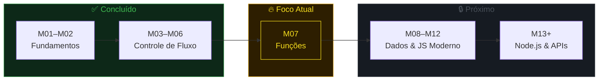
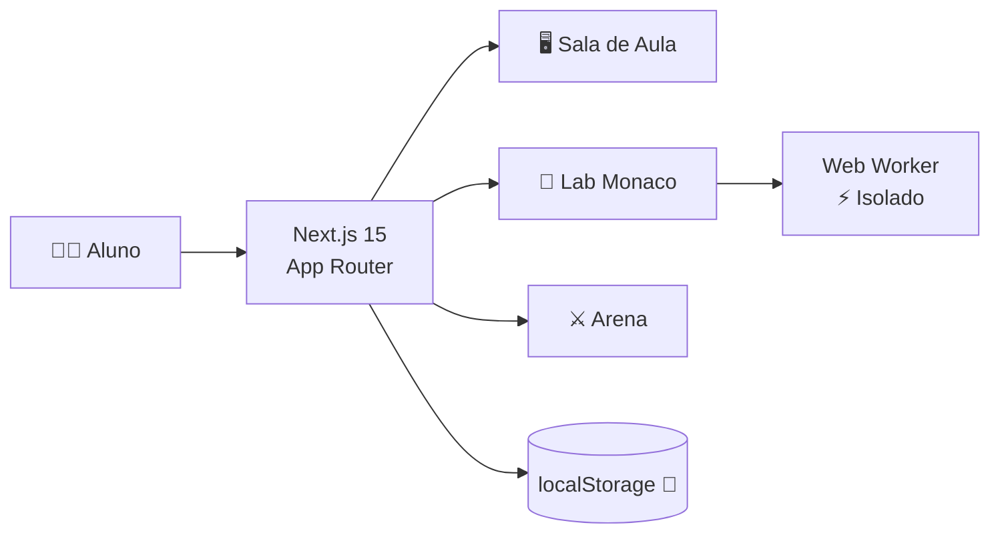

<div align="center">

<picture>
  <source media="(prefers-color-scheme: dark)" srcset="./docs/assets/logo.svg">
  
</picture>

<br/><br/>

[](https://nextjs.org/)
[](https://react.dev/)
[](https://www.typescriptlang.org/)
[](https://developer.mozilla.org/en-US/docs/Web/JavaScript)
[](./LICENSE)

Plataforma educacional interativa com sala de aula, laboratório Monaco e arena de desafios.<br/>
Criada durante a formação em **Backend** na Escola SENAI "Dr. Celso Charuri".

[Começar](#-início-rápido) · [Trilha](#-trilha-de-aprendizado) · [Arquitetura](#-arquitetura) · [Autor](#-sobre-o-autor)

</div>

---

## O que é isso?

Não é mais um repositório de exercícios soltos.

O **Campus Backend** é uma plataforma web onde eu estudo JavaScript e pratico lógica com feedback em tempo real — tudo rodando no browser, sem servidor. Construí isso porque queria um lugar que me fizesse **querer estudar todo dia**, não apenas marcar checkbox.

<div align="center">

</div>

<br/>

<table>
<tr>
<td>🖥️ <strong>Sala de Aula</strong></td>
<td>Aulas com modelo mental → código comentado → checkpoint</td>
</tr>
<tr>
<td>🧪 <strong>Laboratório</strong></td>
<td>Monaco Editor + Web Worker isolado — escreva e execute JS no browser</td>
</tr>
<tr>
<td>⚔️ <strong>Arena</strong></td>
<td>Desafios com validação automática e progresso em tempo real</td>
</tr>
<tr>
<td>📊 <strong>Grade</strong></td>
<td>Visualize módulos concluídos, em andamento e planejados</td>
</tr>
<tr>
<td>📚 <strong>Biblioteca</strong></td>
<td>Revisão sem apagar conhecimento conquistado</td>
</tr>
<tr>
<td>🏆 <strong>Conquistas</strong></td>
<td>Marcos de domínio e habilidades praticadas</td>
</tr>
</table>

> **Nota:** Projeto pessoal e independente. Não representa a Escola SENAI "Dr. Celso Charuri".

---

## ⚡ Início Rápido

```bash
git clone https://github.com/carloska24/Pratica_Back-End_Senai.git
cd Pratica_Back-End_Senai
npm install
npm run dev
```

Abra **http://localhost:3000** — progresso salvo no `localStorage`, sem cadastro.

<details>
<summary>Outros comandos</summary>

| Comando | Descrição |
|:---|:---|
| `npm run build` | Build de produção |
| `npm run start` | Executa o build localmente |

</details>

---

## 🗺️ Trilha de Aprendizado

O currículo funciona como uma campanha progressiva — cada fase entrega uma habilidade e abre a próxima.



<details>
<summary><strong>📋 Ver todos os módulos (M01–M12)</strong></summary>

| # | Módulo | Tema | Status |
|:---:|:---|:---|:---:|
| 01 | Fundamentos JavaScript | Variáveis, operadores, tipos | ✅ |
| 02 | Estruturas de Decisão | `if`, `else`, condições | ✅ |
| 03 | Laços com `while` | Repetição controlada | ✅ |
| 04 | Laços com `for` | Contagem e padrões | ✅ |
| 05 | Repetição Avançada | Contadores e acumuladores | ✅ |
| 06 | Laços Aninhados | Padrões em 2 dimensões | ✅ |
| 07 | **Funções** | **Parâmetros, retorno, composição** | **🔥** |
| 08 | Arrays | Busca, índices, mutação | 🔒 |
| 09 | Objetos | Modelagem de informações | 🔒 |
| 10 | Strings, Math, Date | Tratamento de dados | 🔒 |
| 11 | Arrays Modernos | `map`, `filter`, `reduce` | 🔒 |
| 12 | JavaScript Moderno | Arrow functions, spread, destructuring | 🔒 |

</details>

---

## 🧠 Como eu estudo

Antes de escrever código, cada aula constrói um modelo mental do problema:

```
objetivo → pré-requisitos → história do programa → execução passo a passo
         → conceitos → código comentado → leitura mental → checkpoint
```

A ideia é aprender a **prever o comportamento** antes de executar.

---

## 📁 Exercícios

A pasta [`course/exercicios-javascript/`](./course/exercicios-javascript/) tem **69 arquivos `.js`** organizados do M01 ao M12 — dá pra praticar direto no terminal sem rodar a plataforma.

<details>
<summary>Ver estrutura</summary>

```
course/exercicios-javascript/
├── M01/  → fundamentos
├── M02/  → decisões
├── M03/  → while
├── M04/  → for
├── M05/  → repetição avançada
├── M06/  → laços aninhados
├── M07/  → funções
├── M08/  → arrays
├── M09/  → objetos
├── M10/  → strings, math, date
├── M11/  → arrays modernos
└── M12/  → javascript moderno
```

</details>

---

## 🏗️ Arquitetura



<details>
<summary><strong>Detalhes técnicos</strong></summary>

| Camada | Stack | Responsabilidade |
|:---|:---|:---|
| Interface | Next.js 15, React 19, TypeScript, Framer Motion | Navegação e composição |
| Conteúdo | Currículo em TypeScript | Aulas, exemplos e exercícios |
| Laboratório | Monaco Editor + Web Worker | Execução segura no browser |
| Progresso | `localStorage` saneado | Persistência sem servidor |

**Segurança:** o código do aluno roda **exclusivamente** em Web Worker isolado com timeout. Nunca entra no processo do Next.js.

### Estrutura de Pastas

```
├── src/
│   ├── app/            → rotas e shell
│   ├── components/
│   │   ├── classroom/  → sala de aula
│   │   ├── labs/       → laboratório
│   │   └── practice/   → arena de desafios
│   ├── content/        → currículo
│   └── lib/            → persistência e utils
├── course/
│   └── exercicios-javascript/
├── docs/
│   ├── ARCHITECTURE.md
│   ├── PRODUCT.md
│   └── UX_RESEARCH.md
└── package.json
```

</details>

---

## 🚧 Roadmap

- [x] Conteúdo navegável com aulas e exemplos guiados
- [x] Laboratório Monaco com Web Worker isolado
- [x] Arena de desafios com validação e progresso
- [x] Biblioteca de revisão com histórico
- [x] Persistência local via localStorage
- [x] Build de produção validado
- [ ] Autenticação e sync na nuvem
- [ ] Backend real com banco de dados
- [ ] Runner Node.js isolado
- [ ] Testes unitários e E2E
- [ ] Deploy público

---

## 📄 Documentação

| Doc | Conteúdo |
|:---|:---|
| [`PRODUCT.md`](./docs/PRODUCT.md) | Missão e princípios pedagógicos |
| [`ARCHITECTURE.md`](./docs/ARCHITECTURE.md) | Decisões técnicas e segurança |
| [`UX_RESEARCH.md`](./docs/UX_RESEARCH.md) | Pesquisa de experiência de estudo |

---

## 🤝 Contribuindo

Sugestões sobre aulas, exercícios ou experiência são bem-vindas.

```bash
git checkout -b feature/minha-sugestao
git commit -m "feat: adiciona exercício de closures no M07"
git push origin feature/minha-sugestao
```

Ou abra uma [issue](https://github.com/carloska24/Pratica_Back-End_Senai/issues).

---

## 👨‍💻 Sobre o Autor

```json
{
  "name": "Carlos Alexandre Duarte Pereira",
  "role": "Backend Developer em formação",
  "school": "SENAI Dr. Celso Charuri",
  "focus": "JavaScript → Node.js → APIs",
  "module": "M07 — Funções",
  "status": "building in public"
}
```

Este projeto nasceu no meio da prática. Eu queria estudar com constância, revisar lógica sem me perder e enxergar minha evolução módulo por módulo. Em vez de deixar esse material fechado, organizei um campus para quem também quer construir uma base sólida em JavaScript antes de avançar para Backend.

<div align="center">

[](https://www.linkedin.com/in/carlos-duarte-0b4591206)
[](https://github.com/carloska24)
[](mailto:carloska24@gmail.com)

</div>

---

<div align="center">

**Campus Backend** · por [Carlos Alexandre](https://github.com/carloska24)

*study → build → document → share*

</div>