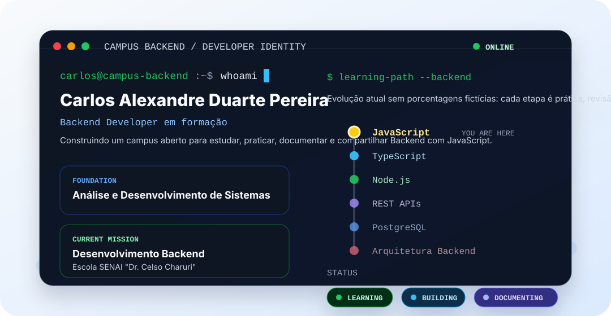
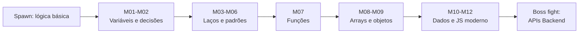
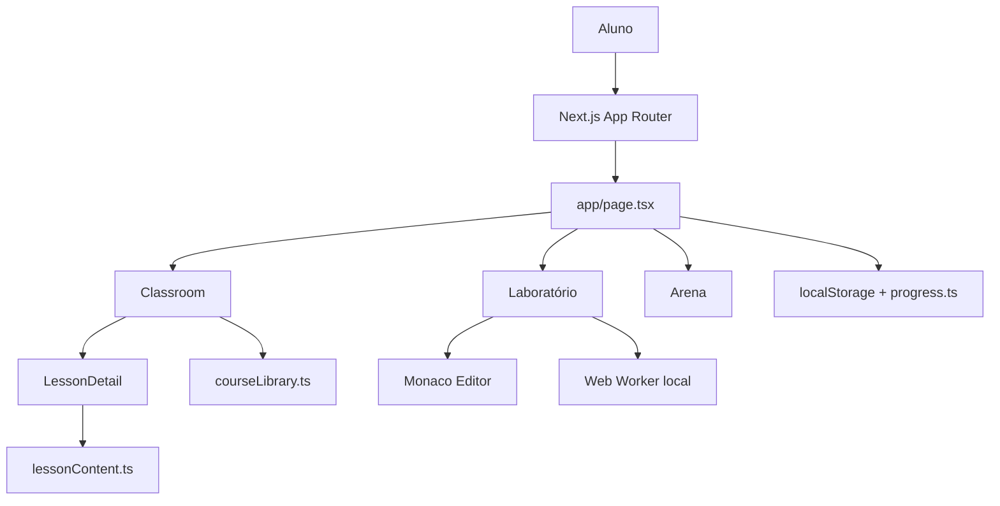

<div align="center">

# Campus Backend

### Curso preparatório em JavaScript para Backend

Projeto de estudos criado por **Carlos Alexandre Duarte Pereira** como um campus preparatório independente para fortalecer lógica, JavaScript e fundamentos de Backend durante a formação rumo ao curso de **Desenvolvedor Backend** da **Escola SENAI "Dr. Celso Charuri"**.

Este repositório organiza aulas, revisões, exercícios em JavaScript, laboratório e acompanhamento de progresso em uma experiência única de aprendizagem, aberta para outras pessoas que também queiram estudar.


</div>

---

## Sobre o projeto

O **Campus Backend** é uma plataforma local de estudos criada para transformar a preparação em Backend JavaScript em uma experiência organizada, visual e progressiva.

O objetivo é ajudar o aluno a responder, em qualquer momento:

| Pergunta | Como o Campus responde |
|---|---|
| Onde estou? | Dashboard, trilha curricular e foco atual do módulo |
| O que já aprendi? | Biblioteca de revisão, conquistas e desempenho |
| Qual é o próximo passo? | Aula atual, laboratório, arena e desbloqueio por domínio |

O projeto não é material oficial do SENAI, não representa a instituição e não substitui as aulas oficiais. Ele é um curso paralelo de preparação e aprofundamento, feito para ganhar mais conhecimento, organizar a prática e disponibilizar uma trilha para outras pessoas que queiram aprender JavaScript com foco em Backend.

---

## Quem está construindo

<div align="center">



</div>

> Este projeto nasceu no meio da prática: eu queria um lugar para estudar com constância, revisar lógica sem me perder e enxergar minha evolução módulo por módulo. Em vez de deixar isso fechado no meu computador, organizei como um campus aberto para quem também quer aprender Backend começando por JavaScript.

<div align="center">

[](https://www.linkedin.com/in/carlos-duarte-0b4591206)
[](mailto:carloska24@gmail.com)
[](https://github.com/carloska24)

</div>

---

## Modo campanha

O Campus foi pensado como uma jornada jogável de aprendizagem: cada módulo entrega uma habilidade, libera uma nova fase e aproxima o aluno do Backend com Node.js.



| Fase | Habilidade desbloqueada | Checkpoint |
|---|---|---|
| Tutorial | Variáveis, operadores e decisões | Ler o fluxo antes de executar |
| Repetição | `while`, `for`, contador e acumulador | Separar a caixinha que percorre da que soma |
| Funções | Entrada, processamento, saída e retorno | Criar blocos reutilizáveis |
| Dados | Arrays, objetos, strings e datas | Modelar informações de um sistema real |
| Backend | Node.js, HTTP, APIs e banco de dados | Transformar lógica em serviço web |

---

## Principais recursos

| Área | Implementação |
|---|---|
| Sala de aula | Aula atual, biblioteca de curso estudado e exemplos guiados |
| Grade curricular | Módulos concluídos, em andamento, liberados e planejados |
| Biblioteca de revisão | Histórico acessível para reestudar sem apagar progresso |
| Laboratório | Monaco Editor com execução JavaScript em Web Worker local |
| Arena de desafios | Exercícios de lógica com progresso local |
| Progresso | Dados persistidos no navegador com saneamento de contadores |
| Conquistas | Badges de domínio por módulo e marcos de aprendizagem |
| Desempenho | Mapa visual de habilidades estudadas |

---

## Proposta pedagógica

O Campus foi desenhado para estudar **JavaScript como linguagem principal**, com direção profissional em **Backend com Node.js**.

A estrutura de cada aula prioriza modelo mental antes da sintaxe:

| Etapa | Finalidade |
|---|---|
| Objetivo | Deixar claro o que será aprendido |
| Pré-requisitos | Conectar o tema com conhecimentos anteriores |
| História do programa | Ler o código como fluxo de acontecimentos |
| Passo a passo | Acompanhar o computador executando |
| Conceitos centrais | Nomear as ideias importantes |
| Código comentado | Mostrar JavaScript com intenção clara |
| Leitura mental | Treinar previsão antes de executar |
| Erros comuns | Antecipar confusões frequentes |
| Checkpoint | Confirmar compreensão antes de avançar |

---

## Currículo

A trilha atual organiza a evolução de fundamentos de lógica até recursos modernos de JavaScript:

| Módulo | Tema | Estado pedagógico |
|---|---|---|
| M01 | Fundamentos JavaScript | Histórico revisável |
| M02 | Estruturas de decisão | Histórico revisável |
| M03 | Laços de repetição com `while` | Histórico revisável |
| M04 | Laços de repetição com `for` | Histórico revisável |
| M05 | Repetição avançada | Contador e acumulador |
| M06 | Laços aninhados | Revisão livre |
| M07 | Funções | Missão final com 4 casos de teste |
| M08 | Arrays | Missão final com 6 casos de teste |
| M09 | Objetos JavaScript | Missão final com 6 casos de teste |
| M10 | Strings, Math e Date | Missão final com 6 casos de teste |
| M11 | Arrays modernos | Missão final com 8 casos de teste |
| M12 | JavaScript moderno | Missão final com 8 casos de teste |

Próximas etapas planejadas: módulos ES, assincronismo, Node.js, HTTP/REST, Express, arquitetura de API, PostgreSQL, persistência, autenticação, testes, Docker e projeto final.

---

## Exercícios JavaScript

Além da experiência visual do portal, o projeto mantém uma pasta própria com exercícios feitos em JavaScript para estudo direto no editor de código.

| Pasta | Conteúdo |
|---|---|
| `exercicios-javascript/` | 69 arquivos `.js` organizados por módulo, do M01 ao M12 |

Os arquivos seguem a mesma trilha exibida no Campus e foram organizados para facilitar revisão, prática individual e consulta por quem estiver acompanhando o curso.

---

## Interface e experiência

O Campus usa uma interface de estudo persistente, com navegação por áreas em vez de uma página única.

| Tela | Papel na experiência |
|---|---|
| Visão geral | Resumo do progresso, foco atual e atalhos |
| Grade curricular | Mapa completo da formação |
| Sala de aula | Aula atual, acervo revisável e exemplos |
| Laboratório | Editor e runner local de JavaScript |
| Arena | Prática gamificada de lógica |
| Conquistas | Marcos de domínio e revisão |
| Desempenho | Leitura visual das habilidades |

A interface usa componentes densos, painéis de estudo, indicadores de progresso, abas, botões com ícones e animações discretas para manter a experiência fluida.

---

## Laboratório

O Laboratório utiliza o **Monaco Editor** para escrever e executar JavaScript localmente.

Fluxo atual:

1. O aluno escreve ou carrega um arquivo `.js`, `.mjs` ou `.txt`.
2. O código é executado em um **Web Worker** do navegador.
3. A execução tem timeout de 1,5 segundo.
4. APIs de rede são desativadas.
5. O console é capturado.
6. Missões finais validam casos de teste específicos.
7. Aprovações registram domínio do módulo no progresso local.

Importante: o código do aluno não é executado dentro do processo do Next.js. Para uma versão de produção com Backend real, a evolução prevista é um runner Node.js isolado, com limites explícitos de CPU, memória, tempo e acesso à rede.

---

## Arquitetura



### Responsabilidades principais

| Arquivo | Responsabilidade |
|---|---|
| `app/page.tsx` | Shell da aplicação, dashboard, currículo, laboratório, arena e desempenho |
| `components/Classroom.tsx` | Navegação entre aula atual, biblioteca e exemplos guiados |
| `components/LessonDetail.tsx` | Componente visual único para aula atual e revisões |
| `lib/course.ts` | Grade, progresso e trilha planejada |
| `lib/courseLibrary.ts` | Aulas, exercícios, desafios e códigos JavaScript |
| `lib/lessonContent.ts` | Conteúdo pedagógico detalhado |
| `lib/functionExamples.ts` | 20 exemplos guiados de funções JavaScript |
| `lib/progress.ts` | Leitura saneada do progresso local |

---

## Estrutura do projeto

```text
estudo-backend-senai-site/
├── app/
│   ├── globals.css
│   ├── layout.tsx
│   └── page.tsx
├── components/
│   ├── Classroom.tsx
│   ├── LessonDetail.tsx
│   ├── PracticeArena.tsx
│   └── CodeViewer.tsx
├── exercicios-javascript/
│   ├── M01/
│   ├── M02/
│   ├── ...
│   └── M12/
├── lib/
│   ├── course.ts
│   ├── courseLibrary.ts
│   ├── functionExamples.ts
│   ├── lessonContent.ts
│   └── progress.ts
├── public/
├── package.json
└── README.md
```

---

## Tecnologias

<div align="center">


&nbsp;&nbsp;

&nbsp;&nbsp;

&nbsp;&nbsp;

&nbsp;&nbsp;


</div>

### Interface

- Next.js 15
- React 19
- TypeScript
- Framer Motion
- Lucide React

### Laboratório

- Monaco Editor
- Web Worker local
- JavaScript executado no navegador com timeout

### Conteúdo estudado

- JavaScript
- Lógica de programação
- Fundamentos para Backend
- Preparação para Node.js e APIs

---

## Progresso local

O navegador armazena localmente:

- itens revisados da biblioteca;
- exemplos guiados concluídos;
- desafios resolvidos na Arena;
- tentativas do Laboratório;
- módulos dominados;
- última aula aberta.

Os dados são saneados antes de serem exibidos. Duplicatas, identificadores inválidos e progresso fora de ordem não aumentam os contadores.

---

## Como executar

### Pré-requisitos

- Node.js instalado
- npm instalado

### 1. Entrar na pasta do projeto

```bash
cd campus-backend-senai-javascript/estudo-backend-senai-site
```

### 2. Instalar dependências

```bash
npm install
```

### 3. Rodar em desenvolvimento

```bash
npm run dev
```

Acesse:

```text
http://localhost:3000
```

### 4. Gerar build de produção

```bash
npm run build
```

---

## Validação atual

O build de produção foi validado com:

```bash
npm run build
```

O projeto ainda não possui uma suite automatizada completa de testes unitários ou E2E. As missões do Laboratório possuem validações locais específicas para os módulos já estruturados.

---

## Limites conhecidos

- O progresso é local ao navegador.
- Ainda não há autenticação ou banco de dados.
- A navegação principal acontece por estado local, não por rotas dedicadas para cada aula.
- O runner atual é adequado para estudo local, mas não substitui um executor isolado de produção.
- Testes unitários e E2E do próprio Campus ainda são uma evolução futura.

---

## Contexto educacional

Este projeto existe para organizar uma rotina real de estudos em Backend JavaScript.

Ele foi criado porque estou fazendo este curso à parte para ganhar mais conhecimento, reforçar lógica e construir uma ponte entre fundamentos e prática profissional com Node.js. A ideia é que o portal também possa ajudar outras pessoas que queiram aprender com a mesma trilha.

---

<div align="center">

**Campus Backend**<br/>
Curso preparatório aberto para estudar JavaScript, lógica e fundamentos de Backend com consistência.

</div>
